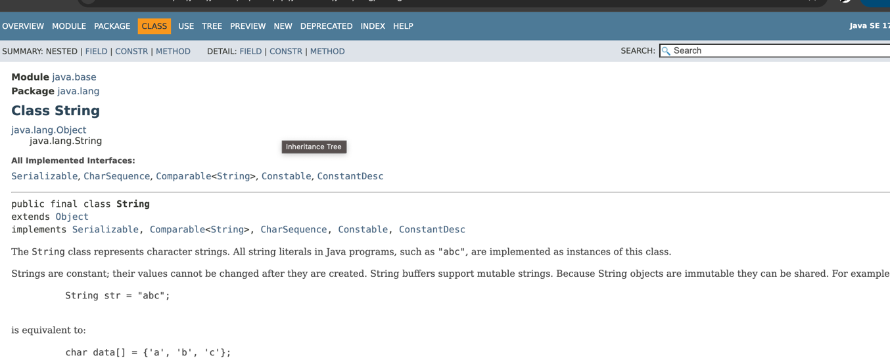

# 0210 Notes 

1.API 도큐먼트
2. java.base 모듈
3. Object 클래스
4. 시스템 클래스
5. 문자열 클래스
6. 포장 클래스
7. 수학 클래스
8. 날자와 시간 클래스
9. 형식 클래스
10. 정규 표현식 클래스
11. 리플렉션

수업 시작전:

자바 SE 버전 —

current java SE versions - jdk 17 쓰는중..

versions in sustaining support - 문제 발생하면 유지보수 계속 해주겠다.

# API 보는 법

- 시그니처 - (선언부확인)
- final 인지, 
- 해당기능들 (implements......) -> 다중 기능 구현되었다라고 함. 
- 전체 상속도 확인 (java.lang.Object - java.lang.Sstring) 
- All implement Interfaces: Comparable<String> (비교해서 크다 작다 등 할 수 있는 것, 그래서 비교 연산자 사요항 필요 없음), ConstantDesc, CharSequence
- 클래스가 갖고 있는 FIELD, NESTED(되어있다면) ==> ex.) <Field Summary> Modifier and Type, Field, Description ==> 클래스가 어떤 필드를 갖고 있고 어떻게 활용있는지 알 수 있다. 
- CONSTR => Constructor Summary (많은 형태의 스트링 클래스 생성자 제공함) 
- METHOD => 클래스가 가진 메소드 나열됨 
  - All Methods,
  - Static Methods : 해당 클래스가 어떤 정적 메소드를 갖고 있는지 
  - Instance Methods : 뉴 하여 사용할 수 있는 메소드들 
  - Concrete Methods : 하나의 독립적인 단위로 바로 사용할 수 있는 메소드들 
  - Deprecated Methods: 더이상 지원하지 않는 사용하지 않는 것이 좋은 메소드들 - 이미 대체된 최신 메소드들이 있음. 

# Object Class 

중요한 메소드 3가지: 
- boolean equals(Object obj) : 객체 동등 비교 시 사용한다. 두개의 주소값을 비교하고 같으면 참, 아니면 거짓을 리턴한다. 
- int hashCode(): 객체의 해시코드(정수)를 리턴한다. HaschCode method of Object class uses an object's memory address to create hash code. Therefore, each object returns different hash code. **자바에서 두 객체 비교할때는 equals() + hashCode() 같이 사용한다.** 
- String toString(): 객체 문자 정보를 리턴. 

자바문서에 가면 ..
자바는 jvm이 쓰레드 관리 한다. 개발자가 직접 스레드 관리 하지 않는다. 
